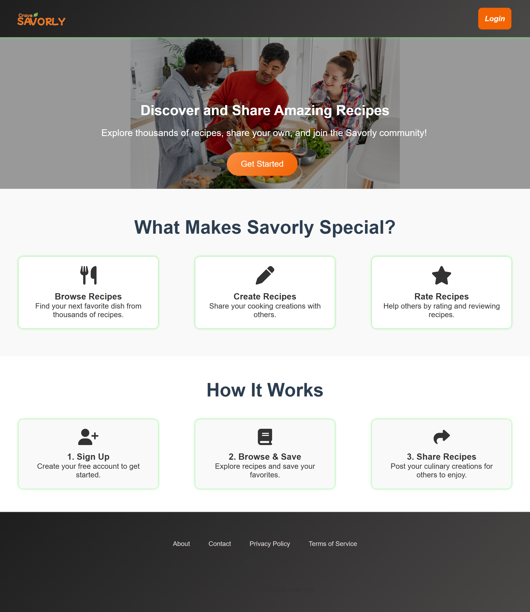
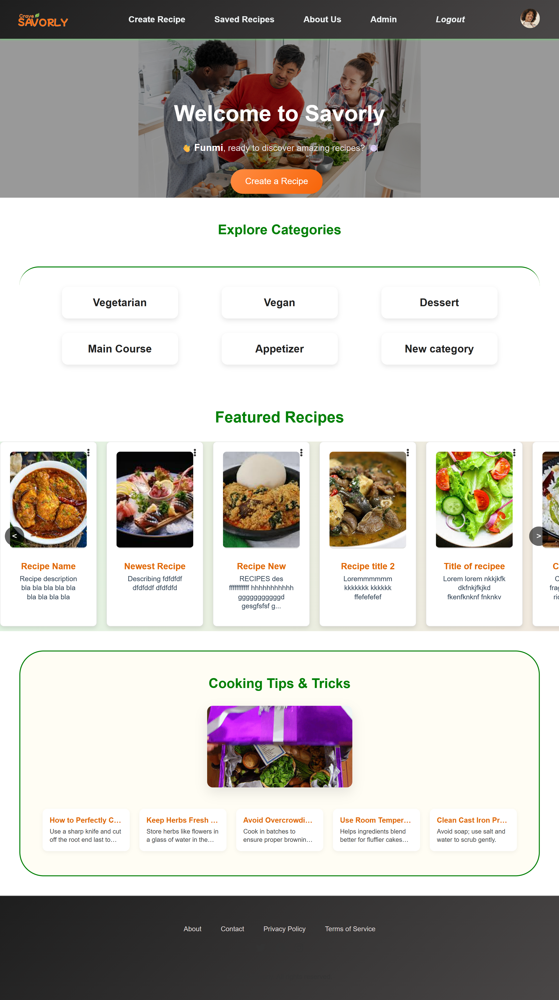
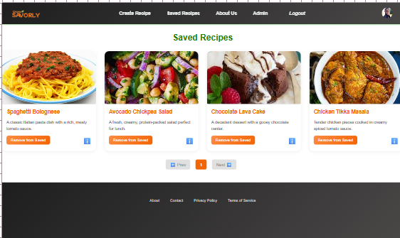

# Savorly 🍲  
**A secure and responsive recipe-sharing platform**

Savorly is a full-stack web application that allows users to browse, create, save, and share recipes. This repository contains the **frontend** of the application, developed with React and deployed to GitHub Pages. It features protected routes, user authentication, role-based access (user/admin), and responsive design.

---

## 🖼️ Screenshots

### Landing Page



> The welcoming and clean landing page for Savorly.

### Home Page



> A clean and responsive homepage featuring categories and tips.

### Admin Dashboard


> Admin interface for managing recipes and users.

### Recipe Form


> Form for creating or editing recipes with validation.

### Saved Recipes



> User's personalized collection of saved recipes.


## 📌 Features

- ✅ User registration, login, and email verification  
- 🔐 Protected routes using JWT-based authentication via secure HTTP-only cookies  
- 👤 Role-based access control (admin/user)  
- 🗂️ Recipe browsing by category  
- 📝 Create, update, and delete recipes (authenticated users)  
- 💾 Save recipes to personal profile  
- ⚙️ Admin dashboard to manage content  
- 📱 Mobile-first responsive design  
- 🌐 Deployed via CI/CD to GitHub Pages (frontend) and Render (backend)  

---

## 🛠️ Technologies Used

### Frontend

- **React 19**  
- **React Router DOM v7**  
- **Axios** for API communication  
- **Vite** for fast bundling and hot reload  
- **FontAwesome & React Icons** for UI elements  
- **Vitest & Testing Library** for unit testing  

### Backend (in production)

- Hosted on **Render**  
- Connected to a **TiDB Cloud** (MySQL-compatible) production database  

### CI/CD & Deployment

- **GitHub Actions** for automated deployment  
- **gh-pages** to deploy the frontend to GitHub Pages  

---

## 🔐 Security Measures

- ✅ Secure HTTP-only cookies for authentication  
- ✅ Passwords hashed using `bcryptjs`  
- ✅ Email verification flow before granting access  
- ✅ Protected frontend routes using a `ProtectedRoute` wrapper  
- ✅ Role-based access for admin and user accounts  
- ✅ Client-side form validation  
- ✅ Input sanitation and validation on the backend  
- ✅ HTTPS enforced via GitHub Pages and Render  

---

## 🧭 Project Structure

savorly-frontend/
├── components/ # Reusable UI components (Navbar, Footer, etc.)
├── contexts/ # React Context for authentication
├── pages/ # Route-level components (Home, Category, Profile, etc.)
├── App.jsx # Main app with route definitions
├── App.css # Global styles
├── index.html # Entry point
├── main.jsx # React root
└── ...

---
## 🚀 Getting Started Locally

Clone the repository and install dependencies:

```bash
git clone https://github.com/elizbeh/savorly-frontend.git
cd savorly-frontend
npm install
npm run dev
⚙️ Environment Variables
Create a .env file at the root of the project with the following environment variables depending on your environment:

Local development .env

LOCAL_HTTPS=true
VITE_API_URL=https://localhost:5001
VITE_CLIENT_URL=https://localhost:5174

Production .env

VITE_API_URL=https://savorly-backend-c6hu.onrender.com
VITE_CLIENT_URL=https://elizbeh.github.io
Note: Actual secrets such as API keys, database credentials, JWT secrets, and email passwords should be stored securely and never committed to source code.

## 🔄 Deployment

### 🌐 Production Deployment

- Frontend deployed to GitHub Pages:  
  https://elizbeh.github.io/savorly-frontend

- Backend deployed on Render:  
  https://savorly-backend-c6hu.onrender.com

- Production database hosted on TiDB Cloud, a scalable MySQL-compatible cloud database.

### 🚀 CI/CD Workflow

This project uses GitHub Actions for continuous integration and deployment:

- Triggered automatically on push to the `master` branch
- Builds the React app using Vite
- Publishes the build to GitHub Pages via the `gh-pages` package
- Uses a GitHub secret token (`PERSONAL_GH_TOKEN`) for authentication

Workflow file: `.github/workflows/deploy.yml`

### 🛠️ Manual Deployment

To manually deploy the frontend:

```bash
npm run build
npm run deploy

## 🧪 Testing

This project uses Vitest and React Testing Library for unit and UI testing.

Run tests with:

```bash
npm run test

Open interactive test UI with:

bash
npm run test:ui

📄 License
This project is licensed under the MIT License.